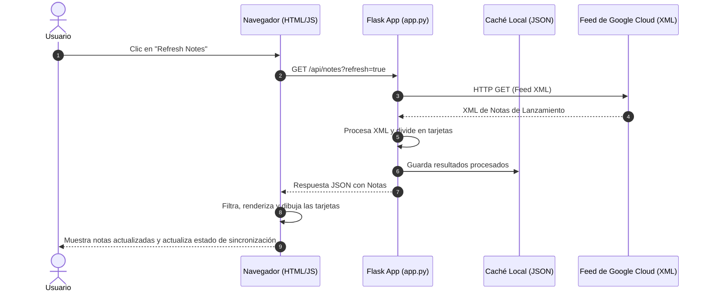

# Guía Detallada del Proyecto: BigQuery Release Notes Explorer

Este documento proporciona una explicación técnica del funcionamiento del explorador de notas de lanzamiento de BigQuery, detallando el flujo de datos, la estructura del cliente y del servidor, y el ciclo de vida de una solicitud típica.

---

## 🧭 Arquitectura General y Funciones Principales

El proyecto sigue una arquitectura clásica de **Cliente-Servidor (Client-Server)** ligera, utilizando **Python Flask** como servidor backend y **HTML/CSS/JS nativo** en el frontend.



---

## 🖥️ Desglose del Servidor (Backend)

El backend está construido sobre [app.py](file:///C:/Users/leja1/agy-cli-projects/app.py) y se encarga de tres tareas críticas:

### 1. Descarga y Parseo XML
*   **Fuente**: Consume el feed XML de Google Cloud (`https://docs.cloud.google.com/feeds/bigquery-release-notes.xml`).
*   **Segmentación por Encabezados**: A diferencia de los agregadores comunes que muestran el bloque diario completo, el script busca patrones `<h3>Tipo</h3>` en el HTML de cada entrada (por ejemplo, `<h3>Feature</h3>`, `<h3>Issue</h3>`, etc.).
*   **División Dinámica**: Divide una sola actualización diaria en múltiples sub-tarjetas independientes. Esto permite al usuario interactuar, filtrar o twittear sobre una mejora técnica específica sin incluir el resto de cambios del mismo día.

### 2. Gestión de Caché Local
*   Para evitar ser bloqueados por exceso de peticiones (rate limiting) y acelerar las cargas de página, las notas procesadas se almacenan en [release_notes_cache.json](file:///C:/Users/leja1/agy-cli-projects/release_notes_cache.json).
*   El caché tiene una validez predeterminada de **1 hora**. Si una solicitud llega dentro de ese rango, se sirve el JSON almacenado al instante.

### 3. Endpoints del API
*   `GET /`: Sirve la interfaz de usuario ([index.html](file:///C:/Users/leja1/agy-cli-projects/templates/index.html)).
*   `GET /api/notes`: Devuelve el JSON estructurado. Soporta el parámetro `refresh=true` para forzar la omisión del caché y solicitar datos nuevos a Google.

---

## 🎨 Desglose del Cliente (Frontend)

El frontend reside en [index.html](file:///C:/Users/leja1/agy-cli-projects/templates/index.html), [style.css](file:///C:/Users/leja1/agy-cli-projects/static/css/style.css), y [app.js](file:///C:/Users/leja1/agy-cli-projects/static/js/app.js).

### 1. Control de Estados y Renderizado Activo ([app.js](file:///C:/Users/leja1/agy-cli-projects/static/js/app.js))
*   **Gestión de Filtros**: Mantiene el estado de la categoría activa (`all`, `feature`, `fix`, `issue`, etc.) y la consulta de búsqueda de texto (`searchQuery`).
*   **Renderizado Dinámico**: Genera elementos del DOM en tiempo de ejecución. Limpia y reinserta tarjetas según los filtros activos.
*   **Construcción de Filtros**: Cuenta cuántas notas pertenecen a cada categoría y actualiza los contadores de la barra lateral en tiempo real.

### 2. Estilo Visual y Micro-interacciones ([style.css](file:///C:/Users/leja1/agy-cli-projects/static/css/style.css))
*   **Aparición Fluida (Transitions)**: Las tarjetas y modales utilizan curvas bezier (`cubic-bezier(0.4, 0, 0.2, 1)`) para transformaciones suaves de opacidad y desplazamiento.
*   **Indicador de Categorías**: Cada tarjeta tiene un borde izquierdo de color que se ilumina al pasar el cursor, coordinado según el tipo de actualización (verde para mejoras, rojo para problemas, morado para anuncios, etc.).
*   **Diseño Responsivo**: Cambia la barra lateral fija por un encabezado superior fluido cuando la pantalla es inferior a 1024px.

### 3. Compositor de Tweets e Integración con X
*   **Simulador de Tarjeta**: Muestra un clon visual de un tweet en modo oscuro, facilitando la visualización del formato final.
*   **Control del Límite de Caracteres (280)**: Un elemento SVG dinámico calcula el arco de progreso de caracteres restantes. Si el texto supera el límite, el círculo se tiñe de rojo y deshabilita el envío.
*   **Plantillas Inteligentes**: Ofrece tres formatos de composición predeterminados (Noticias rápidas, Lanzamiento destacado y Enfoque técnico). Trunca de forma segura la descripción del cambio técnico para asegurar que el enlace y los hashtags quepan sin exceder los 280 caracteres.

---

## 🔄 Flujo de Muestra: Ciclo de Solicitud y Respuesta

Veamos en detalle el flujo cuando el usuario hace clic en el botón de **"Refresh Notes"**:

### Paso 1: Acción del Cliente
El usuario pulsa el botón en el navegador. La función en [app.js](file:///C:/Users/leja1/agy-cli-projects/static/js/app.js) detecta el clic, inicia la animación de carga (spinner), y realiza una petición HTTP asíncrona:
```http
GET /api/notes?refresh=true HTTP/1.1
Host: 127.0.0.1:5000
Accept: application/json
```

### Paso 2: Procesamiento del Servidor
El backend en [app.py](file:///C:/Users/leja1/agy-cli-projects/app.py) recibe la petición con `refresh=true`.
1.  Llama a `requests.get()` al feed XML de Google Cloud.
2.  Extrae los elementos `<entry>`.
3.  Procesa el HTML de la nota. Por ejemplo, si encuentra:
    ```html
    <h3>Feature</h3>
    <p>You can enable autonomous embedding generation...</p>
    ```
4.  Genera una estructura de diccionario limpia y guarda el JSON final en el archivo de caché.

### Paso 3: Respuesta del Servidor
El servidor responde con código de estado `200 OK` y el payload JSON estructurado:
```json
{
  "success": true,
  "title": "BigQuery - Release notes",
  "last_fetched": "2026-06-20T14:40:00.123456",
  "from_cache": false,
  "notes": [
    {
      "id": "tag:google.com,2016:bigquery-release-notes#June_17_2026-0",
      "date": "June 17, 2026",
      "updated": "2026-06-17T00:00:00-07:00",
      "type": "Feature",
      "content_html": "<p>You can enable <a href=\"https://docs.cloud.google.com/bigquery/docs/autonomous-embedding-generation\">autonomous embedding generation</a>...</p>",
      "content_text": "You can enable autonomous embedding generation (https://docs.cloud.google.com/bigquery/docs/autonomous-embedding-generation)...",
      "link": "https://cloud.google.com/bigquery/docs/release-notes#June_17_2026"
    }
  ]
}
```

### Paso 4: Renderizado en el Navegador
El script JavaScript recibe el JSON, deshabilita la animación del cargador y ejecuta `buildCategoriesList()` y `filterAndRender()`. El navegador genera e inserta las tarjetas HTML finales en la página, listas para buscar, filtrar o compartir en X.
